<p align="center">
  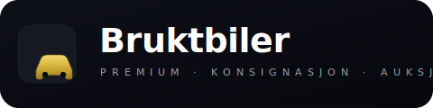
</p>

# Bruktbiler — LB Phone App

En premium bruktbiler-app for [LB Phone](https://docs.lbscripts.com/lb-phone). Komplett bedrift for kjøp, salg, konsignasjon og auksjon av biler — med selger-kontorer, finansiering, reservering, tilbud-forhandling, statistikk og full kommunikasjon.

## Skjermbilder

<table>
  <tr>
    <td align="center">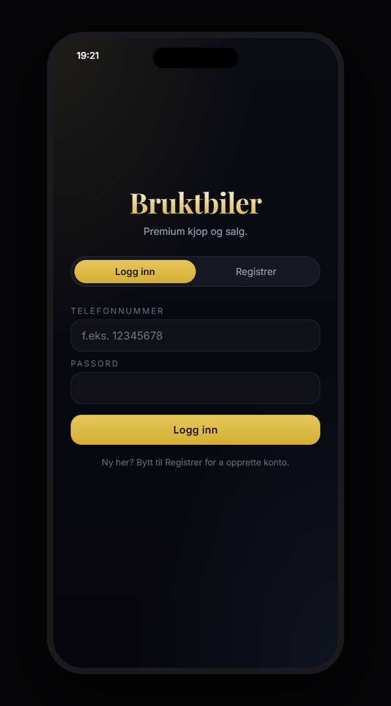<br/><sub>Pålogging</sub></td>
    <td align="center">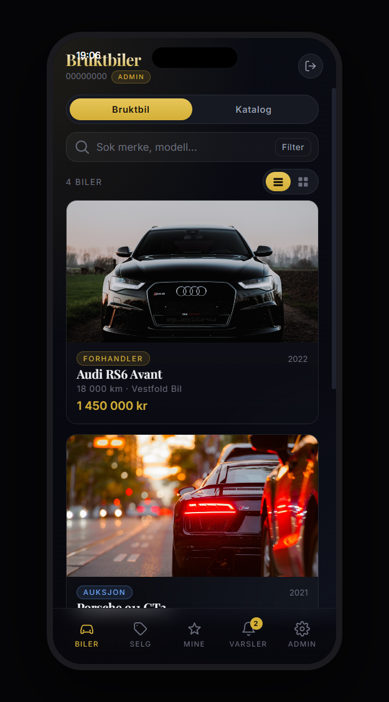<br/><sub>Bil-liste</sub></td>
    <td align="center">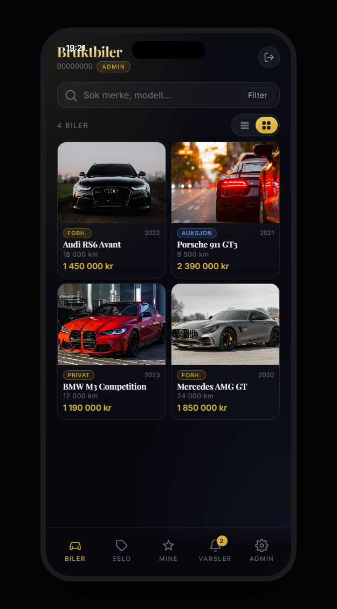<br/><sub>Rutenett-modus</sub></td>
  </tr>
  <tr>
    <td align="center">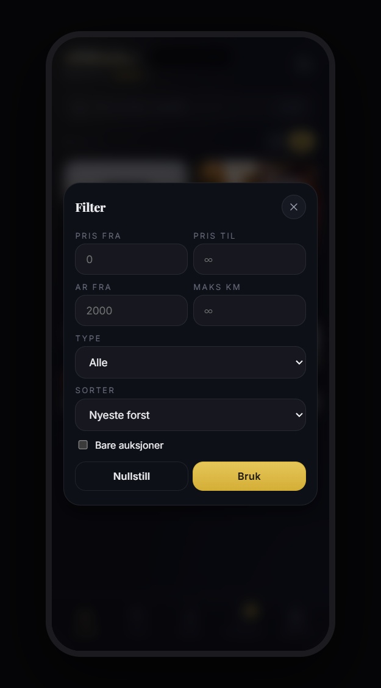<br/><sub>Filter (drawer)</sub></td>
    <td align="center">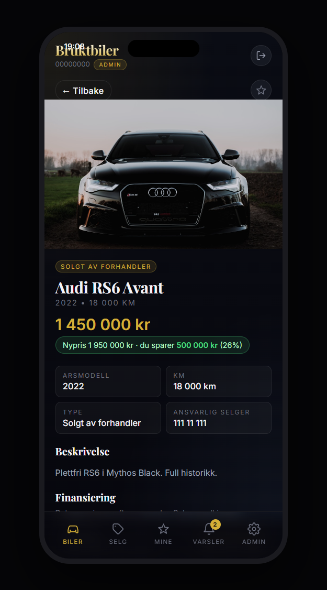<br/><sub>Bil-detalj med finansiering + tilbud</sub></td>
    <td align="center">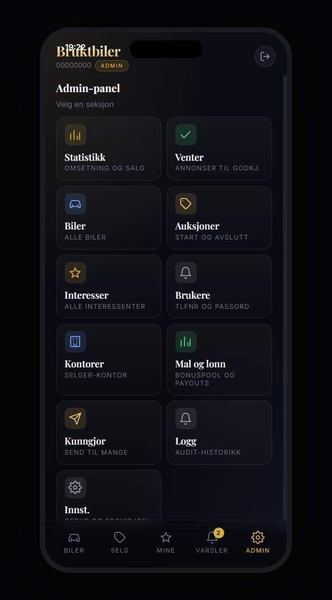<br/><sub>Admin-hjem (tile-meny)</sub></td>
  </tr>
  <tr>
    <td align="center">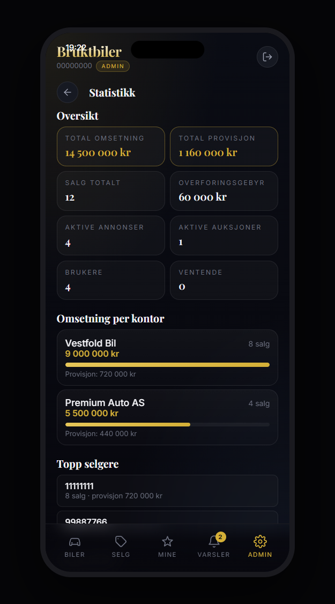<br/><sub>Statistikk-dashbord</sub></td>
    <td align="center">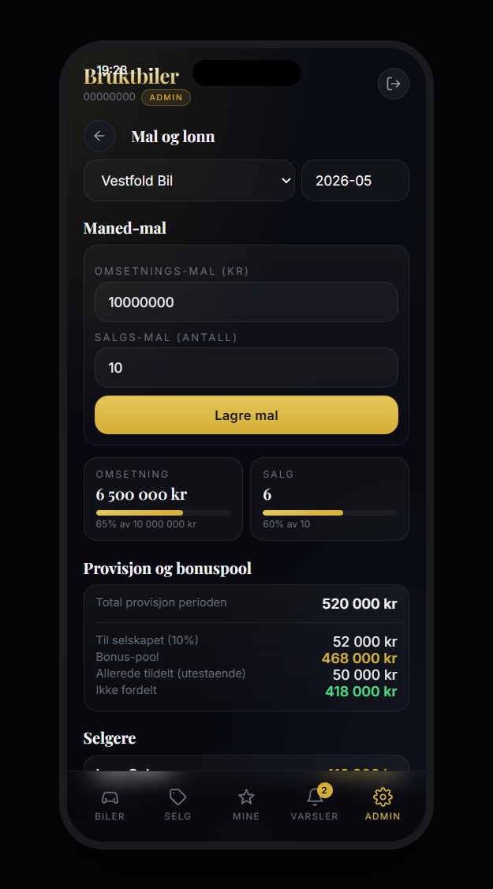<br/><sub>Mål, bonuspool, payouts</sub></td>
    <td align="center">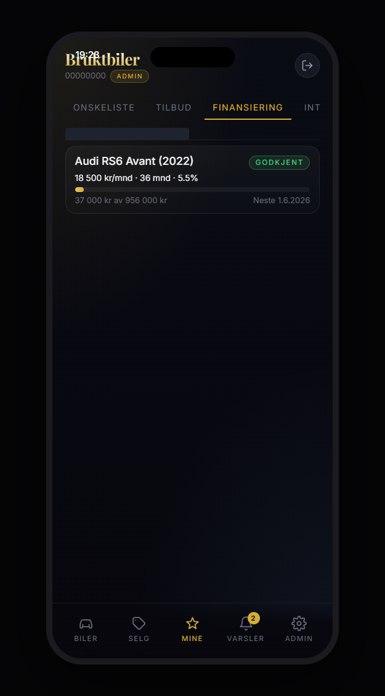<br/><sub>Mine finansieringer</sub></td>
  </tr>
  <tr>
    <td align="center">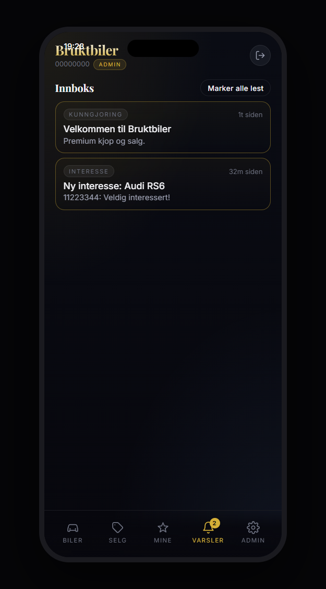<br/><sub>Innboks</sub></td>
    <td align="center">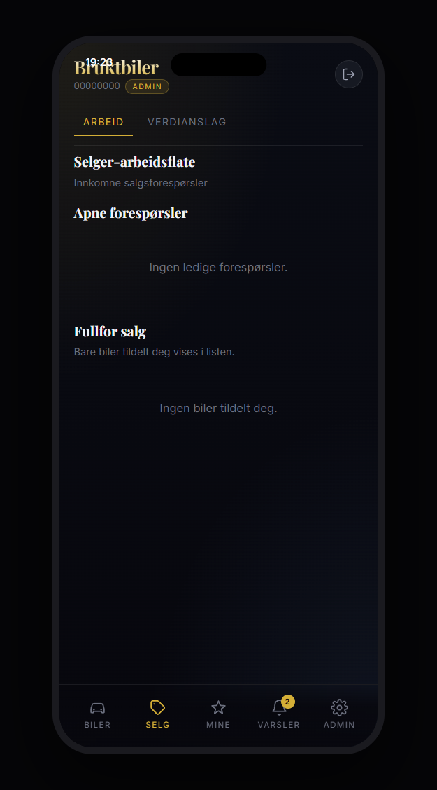<br/><sub>Selg en bil</sub></td>
    <td align="center">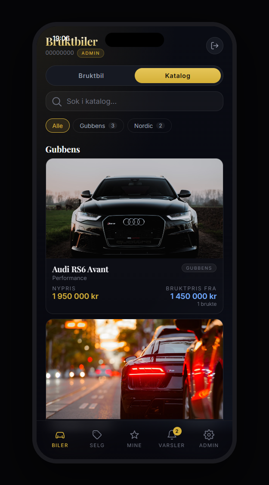<br/><sub>Bilkatalog</sub></td>
  </tr>
  <tr>
    <td align="center">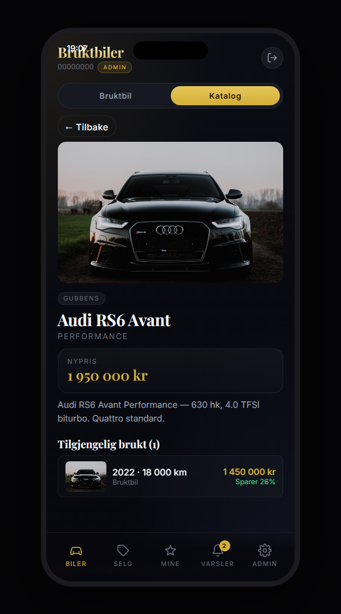<br/><sub>Modell-detalj med brukte</sub></td>
    <td></td>
    <td></td>
  </tr>
</table>

## Funksjoner

### For kunder
- **Auth med tlfnr + navn + passord** (SHA-256 + salt)
- **Søk og filter** på merke, modell, pris, årsmodell, km, type, sortering — med drawer + grid/list-toggle
- **Tilbud / mottilbud** — send pristilbud, selger godtar / avviser / motbud
- **Reservering** — reserver bil i 24t mot depositum
- **Finansiering** — søk nedbetalingsplan med valgfri terminlengde og rente
- **Ønskeliste** + **prisvarsel** — bli varslet når matchende biler dukker opp
- **Bilkatalog** — bla i biler fra forskjellige firmaer (Gubbens, Nordic, ...) med nypris og link til brukte versjoner som er tilgjengelige
- **Du sparer X kr** — bilannonser viser nypris vs salgspris med besparelse i kr og %
- **Vis interesse** — gir push-varsel + innboks-melding til ansvarlig selger
- **Auksjoner** med live nedtelling, bud-historikk og auto-utvarsling om utbud
- **Selg bilen din** — send forespørsel om konsignasjon (i butikk eller med visning hos deg). En selger fra et av kontorene tar over og hjelper deg
- **Direkte chat** med selger på hver bil
- **Innboks** med push-varsler: ny interesse, overbudt, salg fullført, kunngjøringer
- **Mine interesser** og **mine forespørsler** — alt på ett sted

### For selgere (ansatt på et kontor)
- **Salgsforespørsler-kø** — se ledige forespørsler og "ta" en
- **Promoter forespørsel til annonse** med valgfri provisjon
- **Fullfør salg** — tlfnr på kjøper + sluttsum → salg registrert med provisjon og overføringsgebyr
- Chat og innboks som kunder

### For admin
- **Statistikk-dashbord** — total omsetning, provisjon, salg, omsetning per kontor (med stolpediagram), topp selgere, topp merker, siste salg
- **Selger-kontorer** — opprett, rediger, sett provisjon. Tildel ansatte til kontor (én per bruker)
- **Bil-CRUD** — full kontroll over alle biler, status, tildelt kontor og selger
- **Godkjenning av annonser** — venterekke for innsendte forespørsler
- **Auksjoner** — start/avslutt
- **Brukere** — reset passord, gjør til admin
- **Kunngjøringer** — broadcast til alle / alle selgere / et bestemt kontor / alle med interesser
- **Innstillinger** — overføringsgebyr (betales av kjøper), default provisjon, min. budøkning

## Avhengigheter

- [lb-phone](https://docs.lbscripts.com/lb-phone)
- [oxmysql](https://github.com/overextended/oxmysql)
- [ox_lib](https://github.com/overextended/ox_lib)

## Installasjon

1. Klon ressursen til `resources/[bruktbiler]/bruktbiler/` på FiveM-serveren.
2. Sørg for at avhengighetene over kjører før denne ressursen.
3. Bygg UI én gang:
   ```bash
   cd ui
   npm install
   npm run build
   ```
4. Legg `ensure bruktbiler` i `server.cfg`.
5. Start serveren — alle DB-tabeller opprettes automatisk.

### Default admin

| Tlfnr | Passord |
|---|---|
| `00000000` | `admin` |

**Bytt passord med en gang!**

## Utvikling

```bash
cd ui
npm run dev
```

I dev-modus brukes mock-data og UI-en vises i en simulert phone-frame. Endre `fxmanifest.lua` til `ui_page "http://localhost:3000/"` for live-reload mens du jobber, så bytte tilbake til `ui/dist/index.html` før commit.

## Datamodell

| Tabell | Beskrivelse |
|---|---|
| `bb_users` | brukere (tlfnr, hash, salt, is_admin) |
| `bb_sessions` | auth-tokens (TTL fra config) |
| `bb_offices` | selger-kontorer (navn, logo, provisjon) |
| `bb_office_members` | ansatte tilknyttet kontorer |
| `bb_cars` | alle biler — status (`available`/`sold`/`auction`/`pending`/`withdrawn`), listing_type (`dealership`/`consignment_in_shop`/`consignment_remote`/`private`), seller_user_id, assigned_office_id, assigned_seller_id |
| `bb_sell_requests` | forespørsler fra brukere som vil selge |
| `bb_interests` | interessemeldinger på en bil |
| `bb_auctions` + `bb_bids` | auksjoner |
| `bb_sales` | gjennomførte salg (sale_price, transfer_fee, commission_amount, kontor + selger) |
| `bb_messages` | innboks-meldinger (også speilet via lb-phone push) |
| `bb_chat_threads` + `bb_chat_messages` | direkte chat kjøper ↔ selger per bil |
| `bb_settings` | konfigurérbare admin-verdier (gebyr, provisjon, min budøkning) |

## Innstillinger som kan endres i appen

- `transfer_fee` — overføringsgebyr i kr (betales av kjøper på toppen av prisen)
- `default_commission_pct` — default provisjon for nye kontor / godkjenninger
- `auction_increment_min` — minste tillatte budøkning
- `enable_p2p_chat` — slå av/på direkte-chat

## Sikkerhet

Passord hashes med SHA-256 + 16 byte salt. Sesjons-tokens er 32 bytes hex med konfigurerbar TTL (`Config.SessionTTL`, default 7 dager). Alle skrive-callbacks krever gyldig token; admin-callbacks gjør i tillegg `is_admin = 1`-sjekk; selger-callbacks krever medlemskap i et kontor.

For produksjon utenfor FiveM bør hashing byttes til argon2/bcrypt.

## Lisens

MIT
